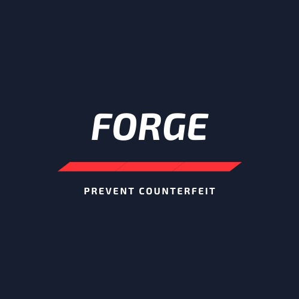

# Steps to run the project

1. install dependencies for smart contracts

```
npm i
```

2. Deploy smart contracts. Ex - 

 ```
 truffle deploy --network development
 ```

3. Copy Address of deployed contracts to React app (in file web3Provider.js)

    update contractAddress (Counterfeit Contract) and buyAddress (Buy Contract)

4. Update nodeUrl and chainId (in file web3Provider.js)

5. Install React app dependencies

```
cd app
npm i
```

5. Run React app

```
cd app
npm start
```


###### ABI of smart contracts are stored in file abi.js in react app


# Team Name - HardFork

<h1 align="center" style="margin-top: 1em; margin-bottom: 3em;">
  <p><a href="#"></a></p>
  <p>🔥 Forge</p>
</h1>

We are working on a blockchain based decentralized web application to fight product counterfeiting. This app help the consumers to don't rely on the the word of the mouth of the seller but the product itself.

# Technology Stack

1. Solidity
2. React
3. Web3.js
4. Truffle
5. Portis
6. Matic
7. Infura

# Functionalities

## Owner Functionalities:

1.  Add Product.
2.  Sell Product to seller.
3.  Transfer Ownership to Other account
4.  Buy/Verify the product as a consumer

## Seller Functionalities:

1.  Sell Product to another seller.
2.  Register themselves as a seller.
3.  Buy/Verify the product as a consumer

## Consumer

1.  Verify the product whether it is genuine or fake by scanning the QR-Code or Product ID.
2.  Buy Product.

### Get the details


### Case of fake product


1.  Add Product
    
2.  Product List
    
3.  Seller registration form.
    
