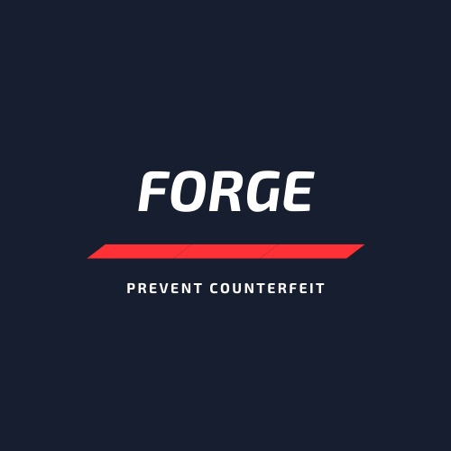

<h1 align="center" style="margin-top: 1em; margin-bottom: 3em;">
  

  
🔥 HardFork

</h1>

We are working on a blockchain based decentralized web application to fight product counterfeiting. This app help the consumers to don't rely on the the word of the mouth of the seller but the product itself.

# Technology Stack

1. Solidity
2. React
3. Web3.js
4. Truffle
5. Portis
6. Matic
7. Infura

# Screenshots

# Home Page:

1.  Allow Owner, Seller and Consumer to register and login through portis.
2.  Allow Users to Verify the product whether it is genuine or fake.

# Owner Functionalities:

1.  Add Product
    
2.  Product List
    
3.  Sell Product to seller.
4.  Sell Product direct to consumer.

# Seller Functionalities:

1.  Sell Product to consumer.
2.  Sell Product to another seller.

# Consumer

1.  Verify the product whether it is genuine or fake by scanning the QR-Code or Product ID.
2.  Buy Product.
